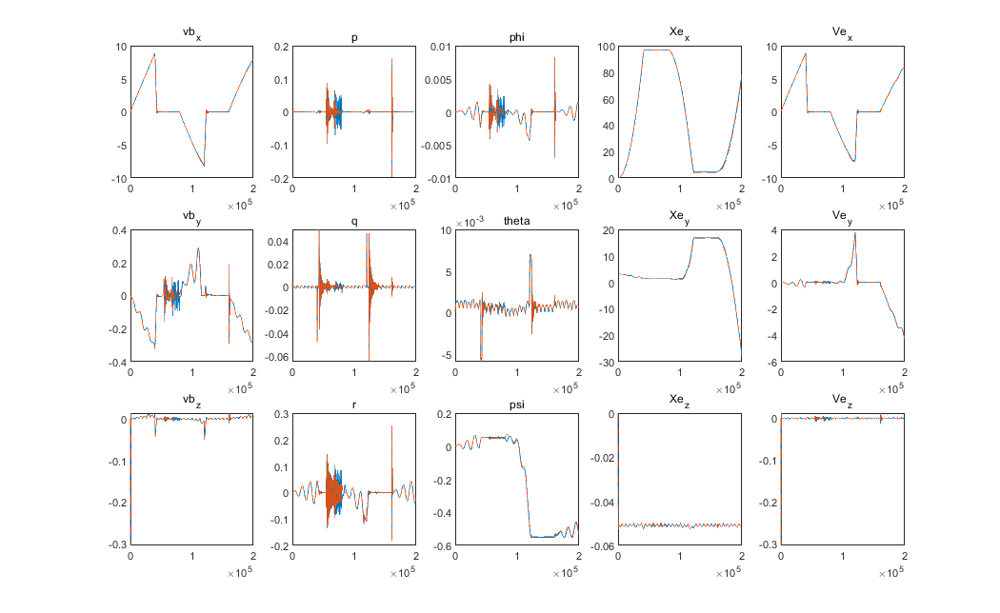
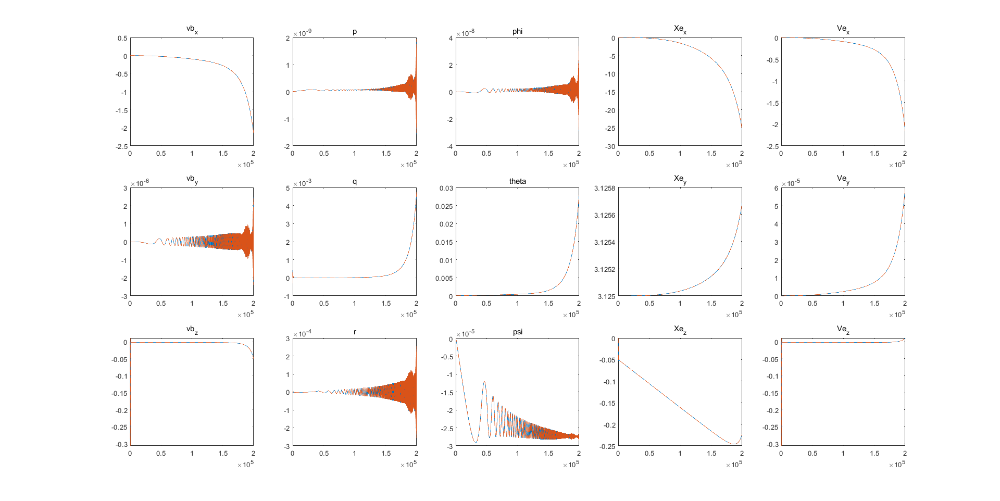
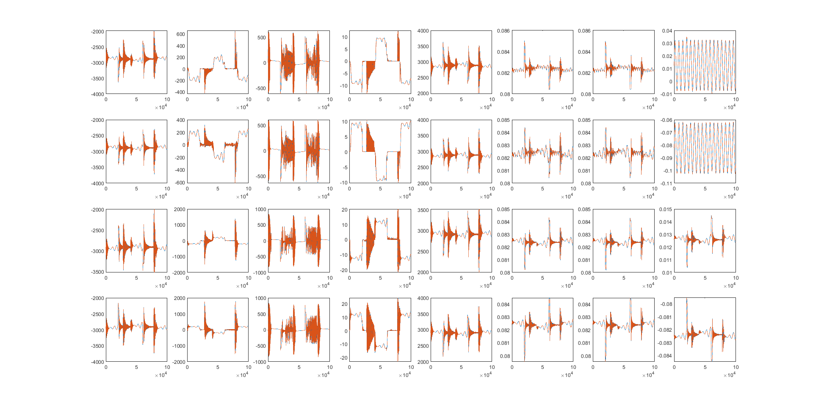
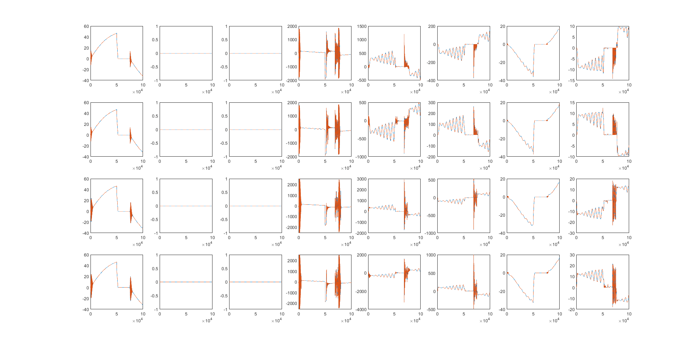

Vehicle dynamics library in C++ 

dependent on boost-1.80.0 library

demo with carla

simulation results compared to simulink model of vehicle dynamics blocks

blue lines are our results and orange dash lines are simulink results

note: SIMULINK VEHICLE DYNAMICS BLOCKS (at least in version 2021 and before) have ERRORS when the car is drving backward.

The car turns without steering input when driving backward

entire chassis sim result

vehicle body sim result

suspension sim result

wheel tire sim result

